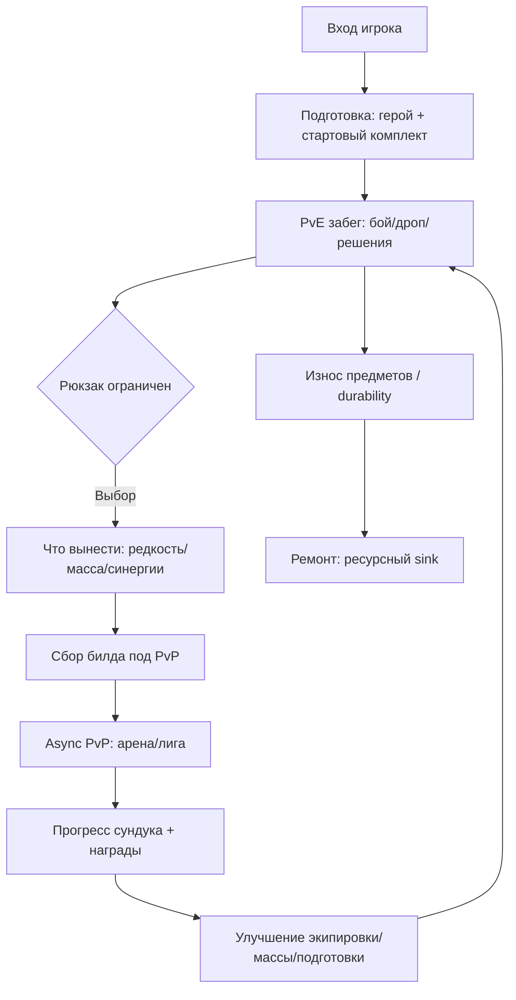
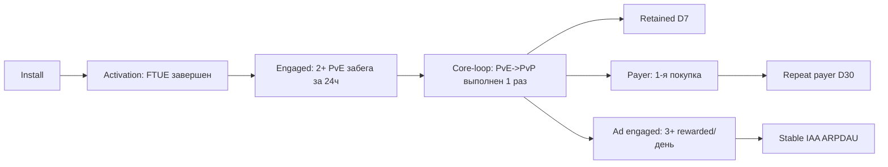
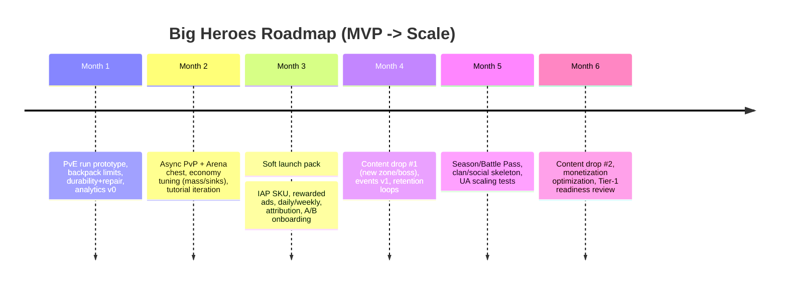

# Рынок мобильных игр и go-to-market для Big Heroes

## Executive summary

Big Heroes по документам — мобильная F2P-игра с гибридным кор-лупом: игрок добывает экипировку и ресурсы в PvE «ран-забеге» с элементами риска/награды и ограничением инвентаря, а затем использует результат в асинхронном PvP (арена и матчмейкинг).

Ключевая дифференциация:

- экстракшн-логика: что вынес — то твое; часть лута может теряться или обесцениваться
- прочность предметов и ремонт как встроенный ресурсный sink
- масса как универсальный ограничитель прогресса и доступа к боям

Рынок мобильных игр в 2024–2026 перешел в фазу умеренного роста при высокой конкуренции за внимание и росте значимости retention и live ops.

По Newzoo, мировой рынок игр в 2025 ожидается на уровне $188.8B, мобильный сегмент — $103.0B (55% выручки), а аудитория игроков — 3.6B, из них mobile players — около 3.0B.

По Sensor Tower, в 2024 IAP-выручка мобильных игр достигла $82B (+4% YoY), при этом скачивания составили около 49B (-7% YoY), а вовлеченность росла: time spent — примерно +8%, sessions — примерно +12%.

Это усиливает главный тезис: побеждают продукты, которые лучше удерживают и монетизируют, а не те, кто просто покупает больше инсталлов.

Для жанрового контекста:

- mobile Role Playing в 2025F — около $18.7B
- strategy в H1 2025 стала топ-кассовой: $10.6B
- RPG — $9.3B за полугодие

Это указывает на перераспределение спроса внутри midcore в сторону более системных и стратегических мета-слоев.

UA и монетизация в 2025–2026 требуют опоры на гибридную монетизацию (IAP + IAA) и точную работу с креативом.

Ключевые рыночные ориентиры:

- D1 retention игровых приложений — около 27% в 2024
- median CPI — снижение с $0.38 до $0.36
- median D7 retention — около 3.42–3.94%
- top-quartile D7 — около 7–8%
- у 75% проектов D28 ниже 3%

Стратегическая рекомендация:

позиционировать Big Heroes как RPG-extraction battler, то есть «короткие PvE-рейды за лут → подготовка билда → арена/лига за сундуки и ранги», и в MVP измерять не только общий retention, но и:

- конверсию в полный цикл PvE → PvP
- качество лута
- экономическую устойчивость: ремонт и sink против инфляции

В roadmap на 3–6 месяцев центральная цель — доказать повторяемый цикл и юнит-экономику в soft launch, прежде чем масштабировать UA.

---

## Ключевые характеристики Big Heroes и гипотезы

### Жанр и формат

Big Heroes описан как asynchronous hybrid RPG battler с двумя связанными режимами:

- PvE-забег — получение лута и ресурсов
- асинхронный PvP — сражения против слепков команд игроков, ранги, сундук и прогресс наград

### Уникальные механики, которые формируют позиционирование и экономику

Экстракшн-логика на уровне RPG:

- ограниченный рюкзак
- выбор, что унести
- ограничения по весу и массе
- последствия поражения и неудачи

Прочность экипировки и ремонт:

- предметы имеют durability
- ломаются
- требуют ресурсов или валюты на восстановление
- создают системный sink, важный для стабильной F2P-экономики

Масса как мета-ограничитель:

- влияет на экипировку
- влияет на доступ к боям и прогрессу
- может стать аналогом power score с издержками: «сильнее = дороже в обслуживании и входе»

Сундук арены как основной пейсмейкер прогрессии:

- прогресс идет через онлайн PvP-бои
- награды завязаны на результат
- PvE работает как подготовка к PvP

### Целевые платформы и MVP

Документ описывает мобильный контекст:

- F2P-модель
- PvP/PvE-циклы
- arena chest
- IAP и ads

Прямое указание engine или tech stack в предоставленной части отсутствует — это открытый вопрос для production plan.

### Монетизация по документу

Внутриигровая экономика предполагает:

- мягкую валюту и ресурсы, в том числе на ремонт
- hard currency для улучшений и ускорений
- расширение инвентаря и рюкзака
- VIP или статусные бусты
- билеты как ограничители попыток и активностей

### Скелет продуктовой гипотезы

---

## Контекст рынка и тренды 2024–2026, важные для Big Heroes

### Размер рынка и «потолок» аудитории

Newzoo оценивает мировой рынок игр в 2025 на уровне $188.8B (+3.4% YoY), а мобильный сегмент — $103.0B (+2.9% YoY), что составляет около 55% доходов рынка.

По аудитории:

- глобальная база игроков — 3.6B (2025)
- mobile players — около 3.0B

### Ключевой парадокс 2024

Выручка и вовлеченность растут, а загрузки — нет.

По Sensor Tower:

- IAP-выручка мобильных игр выросла примерно на 4% до $82B
- загрузки упали до примерно 49B (-7% YoY)
- время и число сессий выросли

Для Big Heroes это означает:

- нельзя выигрывать только через UA
- нужен надежный кор-луп, который тянет retention и ARPU
- live ops нужно закладывать уже в MVP: сундуки, сезоны, события

### Сдвиг к hybrid monetization и рост роли рекламы

Рынок показывает:

- рост гибридной монетизации IAP + ads
- рост роли крупных рекламных платформ в gaming-экосистеме

По Tenjin, структура ad revenue по платформам в Q3 2025:

- Android — около 61%
- iOS — около 39%

### Жанровые сигналы

RPG и стратегия остаются денежными жанрами, но конкуренция в них сверхплотная.

Для Big Heroes это значит следующее:

- если ядро ближе к RPG-коллекционке и билдам, нужно сильное УТП в прогрессии и риске
- если добавить стратегичность через массу, ремонт и тюнинг билда, можно приблизиться к более липкому midcore

---

## Конкурентный анализ

### Карта конкурентов

#### Прямые конкуренты

Midcore RPG с сильным мета-прогрессом, PvE + PvP, экономикой на экипировке и ресурсах, live ops:

- RAID: Shadow Legends
- Summoners War
- Hero Wars
- AFK Arena

#### Косвенные конкуренты

RPG и пазл-гибриды с PvP и рейдами:

- Empires & Puzzles

4X и strategy с асинхронными атаками, гильдиями и сильной монетизацией:

- Clash of Clans
- Top Heroes

Roguelite-раннеры с билд-метой:

- Archero

Отдельный референс по экстракшн-механике:

- Arena Breakout

Это не прямой жанровый конкурент, но важный ориентир по ощущению риска, награды и ценности лута.

### Таблица сравнения конкурентов по ключевым метрикам

Важно: DAU/MAU, retention D7/D30 и LTV по конкретным тайтлам в открытых источниках почти всегда отсутствуют. Обычно они доступны только в платных аналитических панелях.

Поэтому в таблице:

- DAU/MAU — н/д
- retention, LTV и ARPU — ориентиры по индустриальным бенчмаркам и явные допущения
- масштаб игр — по порогу установок в Google Play и публичным оценкам Sensor Tower там, где они доступны

| Игра | Платформа | Жанр/поджанр | Downloads/масштаб | ARPU proxy | LTV proxy | Retention benchmark | Монетизация | CPI estimate | Сильные стороны | Слабые стороны |
|---|---|---|---|---|---|---|---|---|---|---|
| RAID: Shadow Legends | iOS/Android | Midcore RPG, коллекция героев, PvP-арена | GP: 50M+; ST US: ~300k dl / ~$6m rev last month | RPG ARPMAU ~ $3.63 | Для break-even: D180 LTV ≥ CPI × 1.2–1.5 | D1 ~20–27%; D7 median ~3.4–3.9%; D30 ~2–5% | IAP-heavy, live ops | Высокий | Мощный контент, сильный бренд UA-креатива | Высокий барьер входа, донатность |
| Summoners War | iOS/Android | Turn-based RPG, коллекция монстров, PvP | GP: 50M+; ST ~40k dl / ~$4m rev | RPG ARPMAU ~ $3.63 | Аналогично RAID | Benchmarks как выше | IAP, гача, сезонные активности | Высокий | Сильный PvP-геймплей | Сложные системы, высокая конкуренция |
| Hero Wars: Alliance | iOS/Android | Battler RPG, PvE + PvP арена | GP: 100M+; PR: $1.7B rev и 185M installs; ST ~ $5m rev | RPG ARPMAU proxy | Аналогично | Benchmarks как выше | IAP-heavy, aggressive live ops | Высокий | Масштаб, узнаваемость, контент, live ops | P2W-имидж у части аудитории |
| Empires & Puzzles | iOS/Android | Match-3 RPG + база + PvP | GP: 50M+; ST ~70k dl / ~$3m rev | Ниже midcore-гигантов, но выше casual | Proxy | D1 часто выше, D30 зависит от live ops | IAP + random items | Средний/высокий | Дружелюбный onboarding + midcore монетизация | Рынок match-3 перенасыщен |
| AFK Arena | iOS/Android | Idle RPG, коллекция, гильдии, PvP | GP: 10M+; ST ~60k dl / ~$400k rev | Ниже хардкорной RPG | Proxy | Benchmarks общие | IAP + live ops, подписки, pass | Средний/высокий | Сильная коллекционная мета, long tail | Высокая конкуренция в idle-RPG |
| Hustle Castle | iOS/Android | Strategy/RPG/base-building, PvP raids | GP: 50M+; ST ~50k dl / ~$300k rev | Strategy ARPMAU ~ $1.18 | Proxy | Benchmarks общие | IAP + случайные items | Средний | Понятный строю-рейжу loop | Сильная конкуренция base-raids |
| Knighthood | iOS/Android | RPG + PvP arena, билд и гир | GP: 5M+; ST ~40k dl / ~$200k rev | RPG ARPMAU proxy | Proxy | Benchmarks общие | IAP + random items | Средний/высокий | Близко по гиру, билдам и арене | Масштаб меньше лидеров |
| Clash of Clans | iOS/Android | Strategy/base-building, асинхронные рейды | GP: 500M+; Android ~1m dl / ~$7m rev, iOS ~600k dl / ~$14m rev | Strategy ARPMAU proxy | Proxy | Высокий long-tail при сильной социальной структуре | IAP, сезоны, пропуска, косметика | Высокий в Tier-1 | Эталон асинхронного PvP и гильдий | Не про билды и лут напрямую |
| Top Heroes: Kingdom Saga | iOS/Android | 4X/strategy + герои и альянсы | GP: 5M+; ST ~200k dl / ~$9m rev | Strategy ARPMAU proxy | Proxy | Benchmarks общие | IAP-heavy, гильдейная прогрессия | Высокий | Сильная монетизация и социальная тяга | Риск P2W-восприятия |
| Archero | iOS/Android | Roguelike action/RPG, ран-забеги | GP: 50M+; ST ~30k dl / ~$600k rev | Ниже коллекционных RPG | Proxy | Roguelike часто упирается в контент и повторяемость | Ads + IAP | Средний | Близок по UX PvE run + билд | PvP не является ядром |

### Что важно вынести из конкурентов в дизайн Big Heroes

#### PvE как фарм, PvP как витрина прогресса

Это массово валидированный паттерн.

RAID, Hero Wars, Summoners War и AFK/idle-тайтлы удерживают игрока через прогрессию, а затем переводят его в PvP и социальные режимы.

Big Heroes делает этот паттерн более жестким:

PvE — это не просто фарм, а фарм с выбором, риском и ограничением рюкзака.

#### Экстракшн-механика — сильное УТП, но с повышенными требованиями к FTUE

Ставка на риск и награду повышает ценность лута, но также повышает churn, если игроку непонятны правила или потери кажутся несправедливыми.

Для Big Heroes это значит, что в MVP критичны страховки:

- protected slots
- сейф-ячейка
- мягкие штрафы

Иначе D1 и D7 могут быть ниже рынка.

#### Экономика ремонта и прочности — сильный sink, но опасная грань с фрустрацией

Прочность может стабилизировать инфляцию, но если ремонт воспринимается как налог, это бьет по удержанию и NPS.

Поэтому ремонт должен быть:

- предсказуемым
- масштабируемым
- компенсируемым через play-to-earn ресурсы

---

## Аудитория, сегментация и экономика

### Бенчмарки поведения: retention, сессии, CPI, ARPMAU

#### Retention

По Adjust:

- глобальный D1 retention игровых приложений снизился с 28% до 27% в 2024

По сводке GameAnalytics:

- median D7 — около 3.42–3.94%
- top-quartile — около 7–8%
- у 75% проектов D28 ниже 3%

#### CPI

По Adjust, медианный CPI игровых приложений составил $0.36 в 2024, при заметной разнице между регионами и рынками.

#### ARPMAU / ARPMAU IA

Средний ARPMAU по игровым приложениям:

- снижение с $0.31 до $0.28

По жанрам разброс значительный, и RPG заметно выше среднего.

ARPMAU IA (IAP per MAU):

- глобальное снижение с $0.83 до $0.58
- в некоторых жанрах наблюдается рост

Практический вывод:

midcore-подход дает шанс на ARPMAU, который окупает CPI, но только при хорошем долгосрочном удержании.

#### IAA-бенчмарки по форматам

Tenjin показывает средние eCPM по странам (Q1 2024):

Rewarded ads:
- iOS US — около $30
- Android US — около $27.9

Interstitial:
- iOS US — около $19.6
- Android US — около $19.6

Banner:
- iOS — примерно $0.48–$1.25
- Android — примерно $0.35–$1.22

Вывод:

если Big Heroes строит гибридную монетизацию, rewarded video — главный безболезненный формат.

Его можно встроить в PvE-цикл:

- дополнительная попытка
- страховка
- ускорение ремонта

Interstitial стоит использовать осторожно и только вне боевых моментов.

### Таблица сегментации аудитории Big Heroes

Базовый TAM — около 3.0B mobile players.

Доли по сегментам ниже — оценочные допущения, нужные для приоритизации фич и креативов в MVP.

| Сегмент | Что болит / мотивация | Оценка размера | Платежеспособность | Приоритет MVP | Ключевые триггеры продукта и креатива |
|---|---|---:|---|---|---|
| Midcore RPG оптимизаторы билда | Собрать мета-билд, вынести максимум ценности, доминировать в PvP | 0.8–1.5% (≈24–45M) | Высокая | Очень высокий | Экстракшн-лут, durability, арена, сундук, ранги |
| Strategy/4X-гильдейные игроки | Социальная конкуренция, альянсы, рейды, контроль ресурсов | 0.8–1.2% (≈24–36M) | Высокая / средняя | Высокий | Гильдии, кланы, асинхронные атаки, ивенты |
| Roguelite-раннеры (Archero-like) | Короткие сессии, вариативность забегов, рост силы через предметы | 2–4% (≈60–120M) | Средняя | Высокий | Собери лут → вынеси → усилься, быстрые PvE-сессии |
| Экстракшн-фанаты (risk/reward) | Адреналин от риска потери, ценность лута, выйти живым | 0.2–0.6% (≈6–18M) | Средняя / высокая | Средний как УТП | Рюкзак решений, страховка лута как IAP или rewarded |
| Собиратели прогресса | Коллекции, улучшения, ежедневные рутины | 2–5% (≈60–150M) | Средняя | Средний | Сезоны, daily/weekly, коллекционные награды |

### Монетизационная архитектура для Big Heroes

#### Почему гибридная монетизация почти обязательна

Big Heroes потенциально midcore, а значит CPI может быть высоким.

Гибридная модель позволяет:

- поднимать early LTV через IAA, пока IAP-воронка раскачивается
- снижать риск провала окупаемости на Tier-2 рынках
- монетизировать как платящих оптимизаторов, так и неплатящих пользователей, смотрящих рекламу

#### Рекомендованная модель монетизации: MVP → 6 месяцев

IAP core в MVP:

- hard currency
- пакеты ресурсов на ремонт и крафт
- расширение рюкзака
- стартовые бандлы

VIP или подписка post-MVP:

- безопасные QoL-бонусы
- +1 protected slot
- лимит auto-repair
- +1 free revive в день

Важно избегать чистого pay-to-win.

IAA в MVP:

- rewarded за страховку: сохранить 1 предмет при поражении
- +1 попытка PvE
- ускорение ремонта
- удвоение награды сундука в ограниченном виде

Season pass через 3–6 месяцев:

- стабилизатор экономики
- драйвер D30+

#### Воронка монетизации и базовые KPI

---

## Маркетинг, UA, CPI-бенчмарки и ASO

### UA-каналы и структура закупки

Ключевая реальность 2025–2026 — растет влияние крупных performance-экосистем и креативных трендов.

Рекомендуемый микс каналов для Big Heroes:

- Google App Campaigns (UAC) — Android scale и быстрые итерации, особенно Tier-2
- Meta (FB/IG) — broad midcore-аудитория, lookalike на payer и engaged
- TikTok — короткие геймплейные креативы, особенно для экстракшн-хука
- Unity Ads / AppLovin / AdMob — важны и для UA, и для ad monetization

### CPI-ориентиры и как превращать их в LTV-требования

Практическое правило для Big Heroes:

если планируется Tier-1 scale, минимальная цель — D180 LTV должен быть выше CPI минимум на 20–50%.

В soft launch целесообразно начинать с Tier-2/Tier-3 гео:

- держать CPI ниже
- доказать repeatable economics
- затем переносить модель в Tier-1

### ASO-подход

ASO для Big Heroes должно продавать УТП в первые 3 секунды просмотра страницы:

- PvE raid → вынеси лут → стань сильнее → арена / сундук
- рюкзак решений как визуальный элемент на скринах и в видео

Практические ASO-спринты на 6–8 недель:

Семантика:

- RPG / hero / gear / arena
- roguelike / raid / dungeon / loot
- backpack / inventory / management

Креативы:

A/B-тест по обещанию:

1. экстракшн-лут
2. арена / сундуки / ранги
3. ремонт / крафт / билды

Локализация:

- RU / EN
- ключевые Tier-2 языки для soft launch

---

## Метрики MVP, позиционирование и roadmap на 3–6 месяцев

### Продуктовые метрики MVP

Поскольку рынок в среднем держит D1 около 27%, а median D7 у многих проектов низкий, MVP Big Heroes должен целиться в верхнюю часть распределения. Иначе масштабирование UA будет экономически нецелесообразным.

#### Рекомендуемые KPI-гейты для MVP

Retention:

- D1 ≥ 30%
- D7 ≥ 6%
- D30 ≥ 2–3%

Core-loop conversion:

- доля новичков, сделавших PvE → PvP в первые 48 часов: ≥ 35–45%

Session KPI:

- 4–6 сессий в день

Монетизация:

- payer conversion D7 ≥ 1.5–2.5%
- доля rewarded-users ≥ 20–30% среди активных
- ad frequency без роста churn

Экономика:

- ремонт и износ должны быть net-sink
- но не должны ломать прогрессию

### Рекомендации по позиционированию

Формула позиционирования для store и UA:

RPG-рейды с экстракшн-лутом: вынеси добычу → собери билд → побеждай в арене и прокачивай сундук наград.

Ключевые обещания в креативе:

- каждый забег — решение: что унесешь?
- каждая победа — прогресс сундука
- сильная экипировка требует обслуживания

Последний тезис нужно подавать как depth, а не как налог.

### Roadmap MVP на 3–6 месяцев

| Период | Продуктовая цель | Что делаем | Метрики успеха | Ресурсы |
|---|---|---|---|---|
| Месяц 1 | Прототип core feel | PvE-забег, карта/точки, дроп, базовый бой, ограничения рюкзака, прочность и ремонт, аналитика v0 | FTUE completion ≥ 45–55%; 1-й PvE-run completion ≥ 60% | 1 продакт/дизайнер, 2–3 client, 1 server, 1 аналитик part-time, 1 QA |
| Месяц 2 | Замкнуть цикл PvE → PvP | Async PvP, matchmaking, слепки, сундук, награды, баланс массы | Core-loop conversion ≥ 35–45%; D1 ≥ 28–30% | +1 геймдизайнер/экономист, 1 backend |
| Месяц 3 | Soft launch-ready | Daily/weekly, 1 событие, простая витрина, 3–5 IAP SKU, rewarded placements, антифрод, атрибуция | D7 ≥ 5–6%; устойчивый ARPDAU; тестируемый CPI | UA/ASO-специалист, BI/аналитик, monetization designer |
| Месяц 4–6 | Рост и LTV | Новые PvE-зоны и боссы, расширение пула экипировки и аффиксов, сезоны, battle pass, социальные фичи, улучшение матчмейкинга | D30 ≥ 2–3%; payback test в Tier-2; подготовка к Tier-1 | Контент-команда, live ops PM, UA scaling |

Таймлайн:

---

## Источники и допущения

### Источники

- данные рынка по выручке и аудитории — Newzoo
- данные по IAP, загрузкам, engagement и рекламным трендам — Sensor Tower
- UA, retention, ARPMAU и CPI-бенчмарки — Adjust
- retention D7 / D28 как ориентир распределения — пересказ GameAnalytics через Gamigion
- ad monetization (eCPM по форматам, странам и долям сетей) — Tenjin + CAS.AI
- масштаб конкурентов — Google Play и публичные оценки Sensor Tower
- ключевые особенности Big Heroes — из design документа проекта

### Главные допущения

- оценки DAU/MAU и точные retention по конкурентам не включены, так как публично обычно недоступны
- сегментация по размерам — top-down оценка от 3.0B mobile players
- эти оценки нужны для приоритизации MVP, а не как финансовый прогноз

